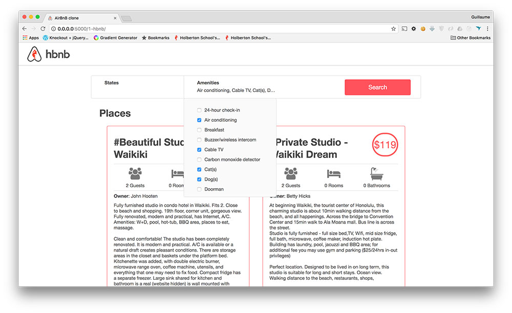

# Web dynamic

Import JQuery

```html
<head>
  <script src="https://code.jquery.com/jquery-3.2.1.min.js"></script>
</head>
```

# 1. for cleaning pycache:

`find . | grep -E "(/__pycache__$|\.pyc$|\.pyo$)" | xargs rm -rf`

# 2. Select some Amenities to be comfortable!



## steps:

1. Replace the route 0-hbnb with 1-hbnb in the file 1-hbnb.py (based on 0-hbnb.py)
2. Create a new template 1-hbnb.html (based on 0-hbnb.html) and update it:
3. Import JQuery in the `<head>` tag

   - `<script src="https://code.jquery.com/jquery-3.2.1.min.js"></script>`

4. Import the JavaScript static/scripts/1-hbnb.js in the `<head>` tag

   - In 1-hbnb.html and the following HTML files, add this variable cache_id as query string to the above `<script>` tag
   - `<script type="text/javascript" src="../static/scripts/1-hbnb.js?{{ cache_id }}"></script>`

5. Add a `<input type="checkbox">` tag to the li tag of each amenity

6. css added: (remember that you height parameter is necessary for handling the overflow)

   ```css
   #checkbox {
     margin-right: 10px;
   }
   ```

   ```css
   .amenities h4 {
     height: 18px;
     overflow: hidden;
     white-space: nowrap;
     text-overflow: ellipsis;
   }
   ```

# 3. To start the API in the port 5001:

```bash
 HBNB_MYSQL_USER=hbnb_dev HBNB_MYSQL_PWD=hbnb_dev_pwd HBNB_MYSQL_HOST=localhost HBNB_MYSQL_DB=hbnb_dev_db HBNB_TYPE_STORAGE=db HBNB_API_PORT=5001 python3 -m api.v1.app
...
```

**our goal in this task was to add a new div to show us the connection status with the api**
